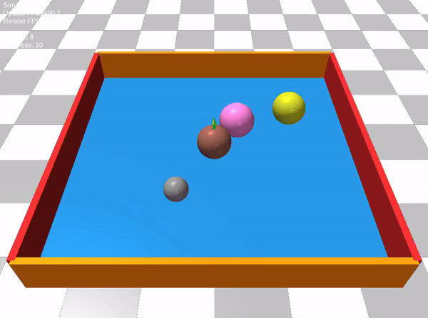
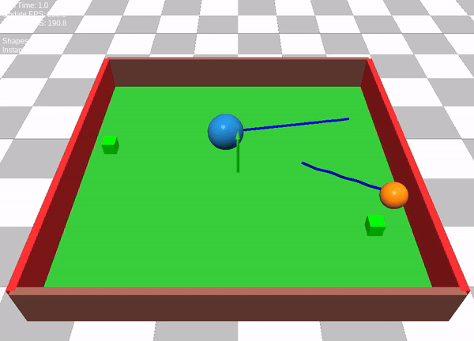
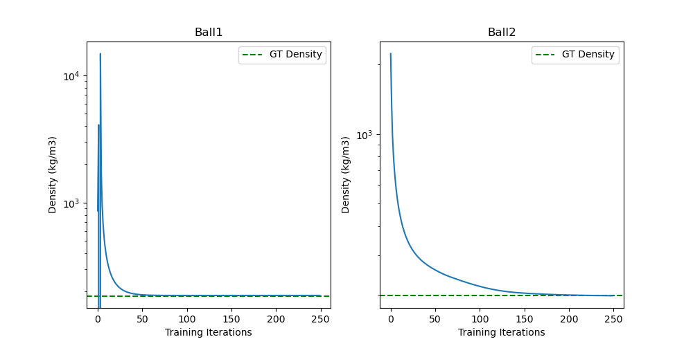

# MatProp3D: Learning Material Properties for interactive 3D reconstruction

# Environment Setup
```bash
conda create -n matprop3d python=3.1
conda activate matprop3d
pip install --upgrade pip setuptools
pip install -e .
```

Make an empty clean directory to use as project workspace where you store all the outputs.
```bash
export MATPROP3DWS=/path/to/workspace/dir
```

# Test Scene Renders

Test if the Warp and its dependencies is working well.
```bash
python scripts/render_playground.py
```
You should see simulation similar to this:



# Learning Ball Density (in Simulation)

```bash
python3 scripts/learn_density_sim.py
```
You should see simulation similar to this:



After the training iterations completed, you will see following graphs and estimated ball densities.

Here Ground Truth densities of two balls: 185, 200

Initial Guess: 500, 5000

Estimated values: 186.25, 200.28



# Learning Ball Density (in Real)

```bash
python scripts/track_ball.py --video-file data/ball_drop.mp4
```


